# What’s going on?       

## 📌 Цель работы 
Использовать и исследовать влияние ```mutex``` на время и результат работы программы в разных сборках. Различие время работ ```release``` и ```debug``` сборок.              

## ✅ Задание и отчет выполнения
1. Создать 3 потока. Запустите несколько раз программу в ```debug``` и запустите несколько раз в ```release```. Посмотрите какие  получаются значения. Как эти значения отличаются между одинаковыми запусками? Попытайтесь ответить – почему?      

_debug_     
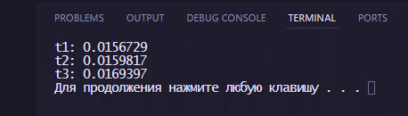     
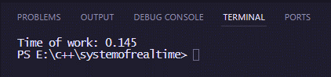     
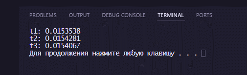     

_release_       
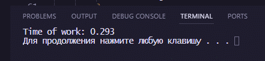     
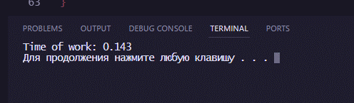     
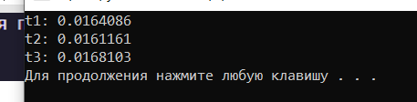     

📸 Объяснение результата:       
В ```debug``` значение меньше полученных в ```release```, т.к. компилятор оптимизирует код. Но в самом ```release``` значения могут сильно варьироваться из-за фоновых процессов.     

2. Удалите переменную ```m```, перезапустите программу несколько раз. Как изменился вывод в консоль?      

_debug_     
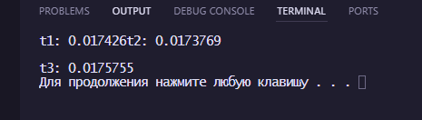     
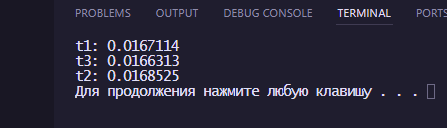     
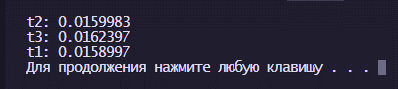     

_release_       
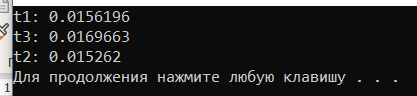     
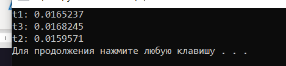     
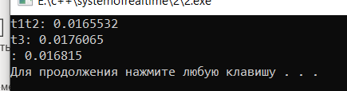     

📸 Объяснение результата:  
После удаления (в нашем случае комментирования) mutex некоторые потоки начали налезать друг на друга в выводе, что отчетливо видно в 3 запуске release и в 1 запуске ```debug```.     

🐱 Результат    
```mutex``` позволяет структурировать потоки. Время ```release``` версии в основном меньше ```debug``` из-за больших оптимизаций, но зависит от фоновых процессов системы.